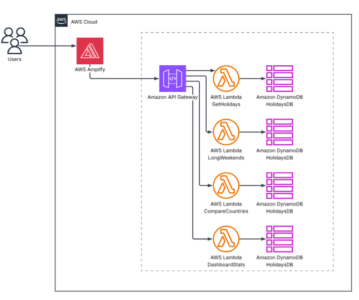

# HolidayImpact App

Aplicación que consume datos públicos de feriados de múltiples países
([Nager.Date API](https://date.nager.at), gratuita y sin API key), los enriquece
con métricas, y los expone mediante una app web interactiva.

## Funcionalidades

- Consultar feriados por país y año
- Detección automática de fines de semana largos ("puentes")
- Comparación de feriados entre países
- Dashboard con métricas adicionales por país (distribución mensual/semanal,
  próximo feriado, cantidad de fines de semana largos)

## Arquitectura

Serverless en AWS: los usuarios acceden a la app React alojada en **AWS Amplify**,
que consume una **API Gateway (HTTP API)**; cada ruta invoca una **función Lambda**
en Python que lee/escribe una tabla **DynamoDB** (`HolidaysDB`) usada como caché de
la API pública Nager.Date.



```
Usuarios
   │
   ▼
AWS Amplify  (React SPA, build automático desde GitHub)
   │
   ▼
Amazon API Gateway  (HTTP API)
   │
   ├─► Lambda GetHolidays ──────┐
   ├─► Lambda LongWeekends ─────┤
   ├─► Lambda CompareCountries ─┤──► Amazon DynamoDB (HolidaysDB, caché TTL 30 días)
   └─► Lambda DashboardStats ───┘              │
                                               ▼
                              Nager.Date API (date.nager.at, solo en cache miss)
```

Las 4 Lambdas comparten su lógica (cliente Nager.Date, caché en DynamoDB, algoritmo
de fines de semana largos, métricas) mediante un **Lambda Layer** común. El backend
ya está aprovisionado en AWS y el frontend se despliega automáticamente desde GitHub
con Amplify en cada push a `main`. Ver [`docs/DEPLOYMENT.md`](docs/DEPLOYMENT.md)
para el detalle de la infraestructura y su configuración.

## Estructura del repo

```
backend/    # 4 Lambdas Python + layer compartido + tests (pytest/moto)
frontend/   # React (Vite) — Home + 4 páginas: Feriados, Fines largos, Comparar, Dashboard
docs/       # Documentación de la infraestructura
amplify.yml # Build spec de Amplify (monorepo, appRoot: frontend)
```

## Despliegue

- **Frontend**: automático desde GitHub vía AWS Amplify en cada push a `main`.
- **Backend**: ya aprovisionado en AWS (DynamoDB, layer, 4 Lambdas, API Gateway).
  Ver [`docs/DEPLOYMENT.md`](docs/DEPLOYMENT.md) para los detalles.
